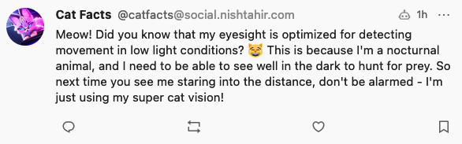

# Cat Facts Bot

A mastodon account bot that posts daily cat facts. This uses PaLM and Bison to generate user friendly daily fact messages to educate us about our feline friends.



## Requirements

* NodeJS 18
* DigitalOcean Functions for Deployments
* MakerSuite/Google Cloud (Vertex AI)

## Environment Variables
* **SERVER_URL** - Your mastodon server URL
* **CAT_FACTS_APP_KEY** - an out of band access token for your bot account
* **PALM_API_KEY** - An API Key for PaLM.

## Deployment

Deployments are run using `doctl`

```
$ doctl sls deploy .
```

## Resources
1. https://docs.digitalocean.com/products/functions/
2. https://docs.joinmastodon.org/spec/oauth/

## License

```
Copyright 2023 Nish Tahir

Licensed under the Apache License, Version 2.0 (the "License");
you may not use this file except in compliance with the License.
You may obtain a copy of the License at

    http://www.apache.org/licenses/LICENSE-2.0

Unless required by applicable law or agreed to in writing, software
distributed under the License is distributed on an "AS IS" BASIS,
WITHOUT WARRANTIES OR CONDITIONS OF ANY KIND, either express or implied.
See the License for the specific language governing permissions and
limitations under the License.

```